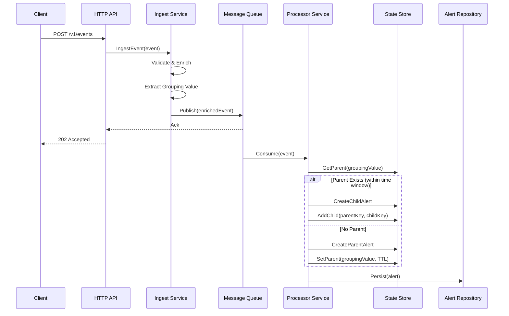

# ArgusGo - High-Throughput Alert Ingestion & Grouping Service

**ArgusGo** is a high-throughput alert ingestion and grouping service designed to receive millions of events, apply grouping logic based on configurable rules, and manage alert lifecycles.

This is the **MVP-1** implementation using in-memory storage, designed to be easily pluggable with production infrastructure (Kafka, Redis, PostgreSQL).

> **Note:** This project is in active development and is not ready for production use.

## Architecture Overview

```
┌─────────────────────────────────────────────────────────────────────────────────┐
│                              ArgusGo Architecture                               │
└─────────────────────────────────────────────────────────────────────────────────┘

                              ┌───────────────────┐
                              │   HTTP Clients    │
                              │  (POST /v1/events)│
                              └─────────┬─────────┘
                                        │
                                        ▼
┌───────────────────────────────────────────────────────────────────────────────┐
│                              HTTP Server (Fiber)                              │
│  ┌─────────────┐ ┌──────────────────┐ ┌─────────────────┐ ┌───────────────┐  │
│  │   Ingest    │ │  Event Manager   │ │  Grouping Rule  │ │    Alert      │  │
│  │   Handler   │ │     Handler      │ │     Handler     │ │   Handler     │  │
│  └──────┬──────┘ └──────────────────┘ └─────────────────┘ └───────────────┘  │
└─────────┼─────────────────────────────────────────────────────────────────────┘
          │
          ▼
┌─────────────────────┐
│   Ingest Service    │
│  ┌───────────────┐  │
│  │  Validate     │  │
│  │  Enrich       │  │
│  │  Route        │  │
│  └───────┬───────┘  │
└──────────┼──────────┘
           │
           ▼
┌─────────────────────┐       ┌─────────────────────┐
│   Message Queue     │       │  Processor Service  │
│   (In-Memory/Kafka) │──────▶│  ┌───────────────┐  │
│                     │       │  │ Group Events  │  │
└─────────────────────┘       │  │ Manage State  │  │
                              │  │ Create Alerts │  │
                              │  └───────┬───────┘  │
                              └──────────┼──────────┘
                                         │
          ┌──────────────────────────────┼──────────────────────────────┐
          │                              │                              │
          ▼                              ▼                              ▼
┌─────────────────────┐    ┌─────────────────────┐    ┌─────────────────────┐
│    State Store      │    │   Alert Repository  │    │ Notification Service│
│  (In-Memory/Redis)  │    │ (In-Memory/Postgres)│    │      (Stubbed)      │
└─────────────────────┘    └─────────────────────┘    └─────────────────────┘
```

## Data Flow



## Key Concepts

### Event Manager
A namespace/tenant abstraction. Each team creates an Event Manager that links to a Grouping Rule, allowing isolated alert management per team or service.

### Grouping Rule
Defines how alerts are grouped together:
- **`grouping_key`**: The event field to group by (e.g., `"class"`)
- **`time_window_minutes`**: How long a parent alert accepts new children

### Alert Lifecycle

```
┌─────────────────────────────────────────────────────────────────┐
│                        Alert Lifecycle                          │
└─────────────────────────────────────────────────────────────────┘

  First Event (unique grouping value)
           │
           ▼
    ┌──────────────┐
    │ Parent Alert │ ◄──── Receives notifications
    │   (active)   │
    └──────┬───────┘
           │
           │ Subsequent events (same grouping value, within time window)
           │
           ├────────────────┬────────────────┐
           ▼                ▼                ▼
    ┌──────────────┐ ┌──────────────┐ ┌──────────────┐
    │ Child Alert  │ │ Child Alert  │ │ Child Alert  │
    │   (active)   │ │   (active)   │ │   (active)   │
    └──────────────┘ └──────────────┘ └──────────────┘

  Resolution Rules:
  • Child alerts can be resolved independently
  • Parent alerts resolve ONLY when ALL children are resolved
  • If parent receives resolve while children active → marked as "resolve_requested"
```

### Alert States
| State | Description |
|-------|-------------|
| `active` | Alert condition is present |
| `resolved` | Alert has been resolved |

### Alert Types
| Type | Description |
|------|-------------|
| `parent` | Root alert that groups children together |
| `child` | Alert grouped under a parent |

## API Endpoints

### Event Ingestion
```http
POST /v1/events
Content-Type: application/json

{
    "event_manager_id": "team-payments",
    "summary": "High CPU usage on payment-service-01",
    "severity": "high",
    "action": "trigger",
    "class": "infrastructure",
    "dedupKey": "payment-service-01:cpu-high"
}
```

### Event Manager CRUD
```http
POST   /v1/event-managers      # Create event manager
GET    /v1/event-managers      # List all event managers
GET    /v1/event-managers/:id  # Get event manager by ID
PUT    /v1/event-managers/:id  # Update event manager
DELETE /v1/event-managers/:id  # Delete event manager
```

### Grouping Rules CRUD
```http
POST   /v1/grouping-rules      # Create grouping rule
GET    /v1/grouping-rules      # List all grouping rules
GET    /v1/grouping-rules/:id  # Get grouping rule by ID
PUT    /v1/grouping-rules/:id  # Update grouping rule
DELETE /v1/grouping-rules/:id  # Delete grouping rule
```

### Alerts (Read-only)
```http
GET /v1/alerts                      # List all alerts
GET /v1/alerts/:dedupKey            # Get alert by dedup key
GET /v1/alerts/:dedupKey/children   # Get children of a parent alert
```

### Health Check
```http
GET /healthz
```

## Project Structure

```
argus-go/
├── cmd/argus/
│   └── main.go                 # Application entry point
├── config/
│   └── config.yaml             # Configuration file
├── internal/
│   ├── api/                    # HTTP handlers (Fiber)
│   │   ├── server.go           # Server setup and middleware
│   │   ├── ingest_handler.go   # Event ingestion endpoint
│   │   ├── event_manager_handler.go
│   │   ├── grouping_rule_handler.go
│   │   └── alert_handler.go
│   ├── config/                 # YAML configuration loading
│   ├── domain/                 # Core business entities
│   │   ├── event.go            # Event model and validation
│   │   ├── alert.go            # Alert model (parent/child, status)
│   │   ├── event_manager.go    # Event Manager model
│   │   └── grouping_rule.go    # Grouping Rule model
│   ├── ingest/                 # Event ingestion service
│   │   └── service.go          # Validates, enriches, publishes
│   ├── processor/              # Alert processing service
│   │   └── service.go          # Grouping logic, state management
│   ├── queue/                  # Message queue abstraction
│   │   ├── queue.go            # Producer/Consumer interfaces
│   │   └── memory/             # In-memory implementation
│   ├── store/                  # Storage abstractions
│   │   ├── state_store.go      # Redis-like state store interface
│   │   ├── repository.go       # DB repository interfaces
│   │   └── memory/             # In-memory implementations
│   └── notification/           # Notification service (stubbed)
└── integration/                # Ginkgo integration tests
```

## Getting Started

### Prerequisites
- Go 1.21+

### Build & Run

```bash
# Build the binary
make build

# Run the application
make run

# Or run directly with Go
go run ./cmd/argus -config config/config.yaml
```

### Running Tests

```bash
# Run all tests
make test

# Run unit tests only
make test-unit

# Run integration tests only
make it

# Generate test coverage report
make coverage
```

### Available Make Commands

| Command | Description |
|---------|-------------|
| `make build` | Build the application binary |
| `make run` | Run the application |
| `make test` | Run all tests (unit + integration) |
| `make test-unit` | Run unit tests only |
| `make it` | Run integration tests only |
| `make fmt` | Format code |
| `make lint` | Run linter (requires golangci-lint) |
| `make clean` | Clean build artifacts |
| `make deps` | Download and tidy dependencies |
| `make coverage` | Generate test coverage report |

## Quick Start Example

```bash
# 1. Start the server
make run

# 2. Create a grouping rule
curl -X POST http://localhost:8080/v1/grouping-rules \
  -H "Content-Type: application/json" \
  -d '{
    "name": "Group by class",
    "grouping_key": "class",
    "time_window_minutes": 30
  }'
# Returns: {"id": "rule-123", ...}

# 3. Create an event manager
curl -X POST http://localhost:8080/v1/event-managers \
  -H "Content-Type: application/json" \
  -d '{
    "name": "Payment Team",
    "grouping_rule_id": "rule-123"
  }'
# Returns: {"id": "em-456", ...}

# 4. Ingest events
curl -X POST http://localhost:8080/v1/events \
  -H "Content-Type: application/json" \
  -d '{
    "event_manager_id": "em-456",
    "summary": "High CPU on server-1",
    "severity": "high",
    "action": "trigger",
    "class": "infrastructure",
    "dedupKey": "server-1:cpu"
  }'
# First event creates a PARENT alert

curl -X POST http://localhost:8080/v1/events \
  -H "Content-Type: application/json" \
  -d '{
    "event_manager_id": "em-456",
    "summary": "High CPU on server-2",
    "severity": "high",
    "action": "trigger",
    "class": "infrastructure",
    "dedupKey": "server-2:cpu"
  }'
# Second event (same class, within time window) creates a CHILD alert

# 5. View alerts
curl http://localhost:8080/v1/alerts
```

## Design Principles

- **Interface-based design**: All storage and queue components use interfaces for easy pluggability
- **Clean architecture**: Separation of concerns between API, business logic, and infrastructure
- **SOLID principles**: Single responsibility, dependency injection throughout
- **Idiomatic Go**: Standard error handling, naming conventions, package organization
- **High testability**: Unit tests for logic, integration tests for flows

## Plugging in Production Infrastructure

The in-memory implementations can be replaced with production systems:

| Component | Interface | Production Implementation |
|-----------|-----------|--------------------------|
| Message Queue | `queue.Producer`, `queue.Consumer` | Kafka |
| State Store | `store.StateStore` | Redis |
| Repositories | `store.*Repository` | PostgreSQL |

## Configuration

Edit `config/config.yaml`:

```yaml
server:
  host: "0.0.0.0"
  port: 8080
  read_timeout: 5s
  write_timeout: 10s
  idle_timeout: 120s

# Future: Kafka configuration
kafka:
  brokers: ["localhost:9092"]
  topic: "argus-events"

# Future: Redis configuration
redis:
  host: "localhost"
  port: 6379

# Future: PostgreSQL configuration
postgres:
  host: "localhost"
  database: "argus"
```

## License

MIT
