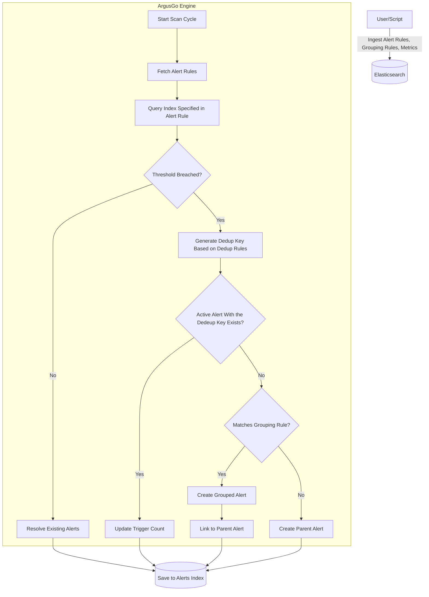

# ArgusGo - Alert Grouping & Deduplication PoC

**ArgusGo** is a Proof of Concept (PoC) project designed to demonstrate advanced alert management capabilities, specifically focusing on **alert deduplication** and **alert grouping**.

It continuously scans ingested metrics against defined alert and grouping rules, and generates alerts and saves them by applying deduplication and grouping logic to minimize alert noise and improve incident management.

While the project includes an end-to-end flow—from ingesting metrics to evaluating rules and generating alerts—its primary purpose is to showcase how alerts can be intelligently managed to reduce noise and group related incidents.

**Potential as a Downstream Tool:**
This project can be adapted to act as a downstream processor that simply ingests alerts by exposing APIs rather than doing the continuous scan. Its main job would be to apply **Grouping Rules** to organize alerts and send notifications, significantly reducing noise. This can be done without relying on the project's current deduplication and alert generation logic (using `dedup_key`) which exists for the purpose of experimentation.

## ⚠️ Disclaimer: Not Production Grade

**Please Note:**
*   This project is a **Proof of Concept (PoC)** and is **NOT intended for production use**.
*   It was developed in a short timeframe (a couple of days) with the assistance of Large Language Models (LLMs) for ideation and coding.
*   **Scalability**: The current implementation is **not scalable**. It processes alerts and rules sequentially and is not designed to handle large volume of data.
*   **Reliability**: Error handling and edge cases may not be fully covered.

## Features

### 1. Alert Deduplication
ArgusGo prevents alert storms by deduplicating alerts based on configurable keys.
*   **Mechanism**: Uses a `dedup_key` generated from specific fields (e.g., `host`, `service`) found in the ingested data (metrics, logs, or other service telemetry). Check `scripts/example_esquery_alert_rules.go` to see how deduplication rules are configured on the alert rule itself.
*   **Behavior**:
    *   **Active Alerts**: If an alert with the same `dedup_key` is already `ACTIVE`, the system updates the existing alert (e.g., increments a trigger count) instead of creating a new one. There can be **at most one** `ACTIVE` alert for a given `dedup_key`.
    *   **Resolved Alerts**: There can be multiple `RESOLVED` alerts with the same `dedup_key` (representing historical incidents).
    *   **Re-activation**: If an alert was previously `RESOLVED` and the condition is met again, a **new** alert document is created. The system does *not* reopen the old resolved alert.
    *   **Coexistence**: It is valid to have multiple `RESOLVED` alerts and one `ACTIVE` alert simultaneously for the same `dedup_key`.

### 2. Alert Grouping
Related alerts can be grouped under a single "Parent" alert to provide better context and reduce clutter.
*   **Mechanism**: Uses `Grouping Rules` to define relationships (e.g., group by `host` or `rule_id` within a time window). Check `scripts/create_grouping_rules.go` for examples.
*   **Behavior**:
    *   **Parent Alert**: Represents the group.
    *   **Grouped Alerts**: Child alerts that are linked to the parent.
    *   When a new alert matches a grouping rule, it is added to the `grouped_alerts` list of the parent alert instead of standing alone.

### 3. Alert Lifecycle
Alerts transition through states based on the underlying metrics:
*   **ACTIVE**: The condition (e.g., CPU > 90%) is currently met.
*   **RESOLVED**: The condition is no longer met. The system automatically resolves alerts when the metric falls below the threshold.

> **Note**: A transition from **ACTIVE** to **RESOLVED** does not happen on the same alert instance. Instead, a new alert instance is created to represent the resolved state.

## Workflow Diagram



## Directory Structure

*   **`cmd/`**: Contains the entry point for the application (e.g., `main.go`).
*   **`internal/`**: Core application logic.
    *   `alert/`: Logic for evaluating rules, saving alerts, and handling deduplication/grouping.
    *   `es/`: Elasticsearch client wrapper.
    *   `banner/`: CLI banner.
*   **`schema/`**: Go struct definitions for Alerts, Rules, and Metrics.
*   **`scripts/`**: Utility scripts for setting up the environment and running scenarios.
    *   `setup_indices.go`: Creates necessary ES indices.
    *   `cleanup_indices.go`: Deletes indices.
    *   `ingest_metrics.go`: Simulates metric ingestion.
    *   `example_esquery_alert_rules.go`: Seeds alert rules.
    *   `create_grouping_rules.go`: Seeds grouping rules.
*   **`integration/`**: Integration tests ensuring the end-to-end flow works as expected.
*   **`instructions/`**: Miscellaneous build or setup instructions for LLMs.
*   **`Makefile`**: Commands to automate build, run, and test tasks.

## Getting Started

### Prerequisites
*   **Go**: 1.25+
*   **Elasticsearch**: Running locally on `http://localhost:9200`.
*   **Kibana** (Optional): For visualizing alerts.

### Setup & Running Scenarios

1.  **Start Elasticsearch**: Ensure your local ES instance is up.

2.  **Setup Indices**:
    Initialize the Elasticsearch indices (`metrics`, `argusgo-alerts`, `esquery_alert`, `grouping_rules`).
    ```bash
    make setup-index
    ```

3.  **Seed Rules**:
    Create sample alert rules and grouping rules.
    ```bash
    make alert-rules
    make grouping-rules
    ```

4.  **Ingest Metrics & Generate Alerts**:
    Run the script to ingest mock metrics.
    ```bash
    make ingest-metrics
    ```
    Then run the application to evaluate these metrics against the rules and generate alerts.
    ```bash
    make run
    ```

5.  **View Alerts**:
    You can inspect the generated alerts in Kibana or by querying Elasticsearch directly:
    ```bash
    curl -X GET "localhost:9200/argusgo-alerts/_search?pretty"
    ```
    Look for fields like `alert_type` ("parent" vs "grouped") and `dedup_key`.

6.  **Cleanup**:
    To reset the environment:
    ```bash
    make clean-index
    ```

### Running Integration Tests

The project includes a suite of integration tests using Ginkgo to verify the alert lifecycle, deduplication, and grouping logic.

To run the tests:

```bash
make it
```

This command runs `go test -v ./integration/...`, which will:
1.  Spin up fresh indices for each test.
2.  Simulate metric ingestion.
3.  Assert that alerts are created, deduplicated, grouped, and resolved correctly.
